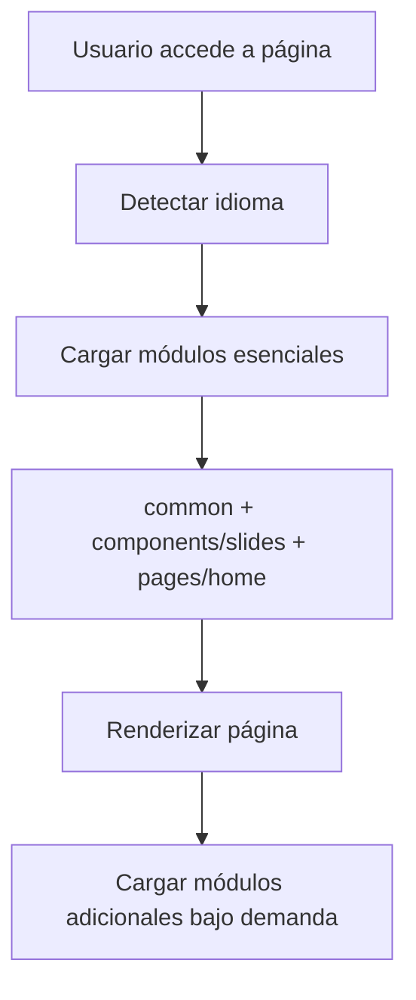

# 🌍 Sistema de Traducciones Modulares - Disruptivo Lab

## 📋 Índice
- [Objetivo](#objetivo)
- [Arquitectura](#arquitectura)
- [Estructura de Carpetas](#estructura-de-carpetas)
- [Idiomas Soportados](#idiomas-soportados)
- [Cómo Funciona](#cómo-funciona)
- [Guía de Uso](#guía-de-uso)
- [Ejemplos Prácticos](#ejemplos-prácticos)
- [Mejores Prácticas](#mejores-prácticas)
- [Troubleshooting](#troubleshooting)

## 🎯 Objetivo

Este sistema de traducciones modulares está diseñado para:

- **Escalabilidad**: Fácil agregar nuevas páginas, componentes e idiomas
- **Mantenibilidad**: Organización lógica y separación de responsabilidades
- **Performance**: Carga bajo demanda de traducciones específicas
- **Reutilización**: Componentes traducidos pueden usarse en múltiples páginas
- **Colaboración**: Estructura clara para equipos de desarrollo y traducción

## 🏗️ Arquitectura

### Principios de Diseño

1. **Separación por Función**: Componentes vs Páginas vs Elementos Comunes
2. **Carga Modular**: Solo se cargan las traducciones necesarias
3. **Jerarquía Clara**: Estructura intuitiva y predecible
4. **Escalabilidad**: Fácil expansión sin reestructuración

### Flujo de Carga



## 📁 Estructura de Carpetas

```
src/locales/modular/
├── 📁 common/                    # Elementos transversales
│   ├── 📄 es.json               # Navbar, footer, botones comunes
│   ├── 📄 en.json               # Mensajes de error globales
│   ├── 📄 fr.json               # Elementos de navegación
│   ├── 📄 ja.json               # Textos compartidos
│   ├── 📄 ko.json
│   ├── 📄 pt.json
│   └── 📄 zh.json
├── 📁 components/               # Componentes reutilizables
│   ├── 📁 slides/              # Slides del carousel principal
│   │   ├── 📄 es.json          # hero, agents, seo, automation, etc.
│   │   ├── 📄 en.json
│   │   ├── 📄 fr.json
│   │   ├── 📄 ja.json
│   │   ├── 📄 ko.json
│   │   ├── 📄 pt.json
│   │   └── 📄 zh.json
│   └── 📁 modals/              # Modales del sistema
│       ├── 📄 es.json          # contact, video, confirmation
│       ├── 📄 en.json
│       ├── 📄 fr.json
│       ├── 📄 ja.json
│       ├── 📄 ko.json
│       ├── 📄 pt.json
│       └── 📄 zh.json
└── 📁 pages/                   # Contenido específico de página
    ├── 📁 home/                # Página principal
    │   ├── 📄 es.json          # Meta tags, contenido único
    │   ├── 📄 en.json
    │   ├── 📄 fr.json
    │   ├── 📄 ja.json
    │   ├── 📄 ko.json
    │   ├── 📄 pt.json
    │   └── 📄 zh.json
    └── 📁 method/              # Página de metodología
        └── 📄 .gitkeep         # (Preparado para futuras traducciones)
```

## 🌐 Idiomas Soportados

| Código | Idioma | Región Principal | Estado |
|--------|--------|------------------|--------|
| `es` | Español | España/Latinoamérica | ✅ Completo |
| `en` | English | Global | ✅ Completo |
| `fr` | Français | Francia/Canadá | ✅ Completo |
| `pt` | Português | Brasil/Portugal | ✅ Completo |
| `ja` | 日本語 | Japón | ✅ Completo |
| `ko` | 한국어 | Corea del Sur | ✅ Completo |
| `zh` | 中文 | China | ✅ Completo |

### Mapeo de Códigos Regionales

El sistema automáticamente mapea códigos regionales:
- `es-mx`, `es-ar`, `es-co` → `es`
- `en-us`, `en-gb`, `en-ca` → `en`
- `pt-br`, `pt-pt` → `pt`
- `fr-fr`, `fr-ca` → `fr`

## ⚙️ Cómo Funciona

### 1. Detección de Idioma

```javascript
// Prioridad de detección:
1. localStorage ('disruptivo-locale')
2. navigator.language
3. navigator.languages[]
4. Fallback: 'en'
```

### 2. Carga Modular

```javascript
// Módulos esenciales (carga automática):
- common/              // Siempre
- components/slides/   // Para página home
- pages/home/         // Para página home

// Módulos bajo demanda:
- components/modals/   // Cuando se abre un modal
- pages/method/       // Cuando se visita /method
```

### 3. Sistema de Claves

```javascript
// Estructura de claves:
t('hero.title')           // → components/slides/
t('contact.form.name')    // → components/modals/
t('navigation.menu')      // → common/
t('meta.title')          // → pages/home/
```

## 📖 Guía de Uso

### Para Desarrolladores

#### 1. Usar traducciones en componentes

```tsx
import { useModularTranslation } from '@/contexts/modular-translation-context';

function MyComponent() {
  const { t, loadModularTranslation } = useModularTranslation();
  
  // Cargar módulo específico si es necesario
  useEffect(() => {
    loadModularTranslation('components/modals');
  }, []);
  
  return (
    <div>
      <h1>{t('hero.title')}</h1>
      <p>{t('hero.subtitle')}</p>
    </div>
  );
}
```

#### 2. Agregar nuevos componentes

```bash
# 1. Crear carpeta para el nuevo componente
mkdir src/locales/modular/components/forms/

# 2. Crear archivos para cada idioma
touch src/locales/modular/components/forms/{es,en,fr,pt,ja,ko,zh}.json

# 3. Actualizar el contexto de traducción (si es necesario)
```

#### 3. Agregar nuevas páginas

```bash
# 1. Crear carpeta para la nueva página
mkdir src/locales/modular/pages/about/

# 2. Crear archivos de traducción
touch src/locales/modular/pages/about/{es,en,fr,pt,ja,ko,zh}.json
```

### Para Traductores

#### 1. Estructura de archivos JSON

```json
{
  "section": {
    "subsection": {
      "key": "Texto traducido",
      "key_with_params": "Hola {name}, tienes {count} mensajes"
    }
  }
}
```

#### 2. Convenciones de nomenclatura

- **Secciones**: `hero`, `contact`, `navigation`
- **Subsecciones**: `form`, `buttons`, `messages`
- **Claves**: `title`, `subtitle`, `cta`, `placeholder`

#### 3. Parámetros dinámicos

```json
{
  "welcome": "Bienvenido {name}",
  "items_count": "Tienes {count} elementos",
  "progress": "Progreso: {current} de {total}"
}
```

## 💡 Ejemplos Prácticos

### Ejemplo 1: Slide de Hero

**Archivo**: `components/slides/es.json`
```json
{
  "hero": {
    "title": "Innovación Aplicada para Crecer tu Negocio",
    "subtitle": "Aumenta tus ventas 3x, reduce costos operativos y automatiza procesos",
    "cta": "Acelera tu Crecimiento"
  }
}
```

**Uso en componente**:
```tsx
function HeroSlide() {
  const { t } = useModularTranslation();
  
  return (
    <div>
      <h1>{t('hero.title')}</h1>
      <p>{t('hero.subtitle')}</p>
      <button>{t('hero.cta')}</button>
    </div>
  );
}
```

### Ejemplo 2: Modal de Contacto

**Archivo**: `components/modals/es.json`
```json
{
  "contact": {
    "title": "Contáctanos",
    "form": {
      "name": "Nombre completo",
      "email": "Correo electrónico",
      "submit": "Enviar mensaje"
    }
  }
}
```

**Uso en componente**:
```tsx
function ContactModal() {
  const { t, loadModularTranslation } = useModularTranslation();
  
  useEffect(() => {
    loadModularTranslation('components/modals');
  }, []);
  
  return (
    <form>
      <h2>{t('contact.title')}</h2>
      <input placeholder={t('contact.form.name')} />
      <input placeholder={t('contact.form.email')} />
      <button>{t('contact.form.submit')}</button>
    </form>
  );
}
```

## ✅ Mejores Prácticas

### 1. Organización de Claves

```json
// ✅ Bueno: Jerarquía clara
{
  "hero": {
    "title": "...",
    "subtitle": "...",
    "cta": "..."
  }
}

// ❌ Malo: Claves planas
{
  "hero_title": "...",
  "hero_subtitle": "...",
  "hero_cta": "..."
}
```

### 2. Nombres Descriptivos

```json
// ✅ Bueno: Descriptivo
{
  "form": {
    "validation": {
      "email_required": "El email es obligatorio",
      "email_invalid": "Formato de email inválido"
    }
  }
}

// ❌ Malo: Genérico
{
  "error1": "El email es obligatorio",
  "error2": "Formato de email inválido"
}
```

### 3. Consistencia entre Idiomas

```json
// Todas las traducciones deben tener la misma estructura
// es.json
{
  "hero": {
    "title": "Título en español",
    "subtitle": "Subtítulo en español"
  }
}

// en.json
{
  "hero": {
    "title": "Title in English",
    "subtitle": "Subtitle in English"
  }
}
```

### 4. Carga Eficiente

```tsx
// ✅ Bueno: Cargar solo lo necesario
useEffect(() => {
  if (showModal) {
    loadModularTranslation('components/modals');
  }
}, [showModal]);

// ❌ Malo: Cargar todo al inicio
useEffect(() => {
  loadModularTranslation('components/modals');
  loadModularTranslation('components/forms');
  loadModularTranslation('pages/about');
}, []);
```

## 🔧 Troubleshooting

### Problema: Traducción no aparece

**Síntomas**: Aparece la clave en lugar del texto traducido

**Soluciones**:
1. Verificar que el módulo esté cargado:
   ```tsx
   useEffect(() => {
     loadModularTranslation('components/slides');
   }, []);
   ```

2. Verificar la estructura de claves:
   ```json
   // Archivo: components/slides/es.json
   {
     "hero": {
       "title": "Mi título"
     }
   }
   ```

3. Verificar el uso correcto:
   ```tsx
   t('hero.title') // ✅ Correcto
   t('hero_title') // ❌ Incorrecto
   ```

### Problema: Idioma no cambia

**Síntomas**: La interfaz no se actualiza al cambiar idioma

**Soluciones**:
1. Verificar que el contexto esté envolviendo la aplicación
2. Usar `changeLocale()` del contexto
3. Verificar que los archivos de traducción existan

### Problema: Performance lenta

**Síntomas**: La aplicación tarda en cargar traducciones

**Soluciones**:
1. Cargar módulos bajo demanda
2. Verificar que no se estén cargando módulos innecesarios
3. Usar el cache del contexto

## 📊 Estado Actual del Sistema

### Módulos Implementados

| Módulo | Archivos | Estado | Traducciones |
|--------|----------|--------|--------------|
| `common/` | 7 idiomas | ✅ Completo | Navegación, botones |
| `components/slides/` | 7 idiomas | ✅ Completo | 6 slides principales |
| `components/modals/` | 7 idiomas | ✅ Completo | 3 tipos de modales |
| `pages/home/` | 7 idiomas | ✅ Completo | Meta tags, contenido único |
| `pages/method/` | 0 archivos | 🚧 Preparado | Carpeta creada |

### Estadísticas

- **Total de archivos**: 28 archivos JSON
- **Total de traducciones**: ~300 claves traducidas
- **Cobertura de idiomas**: 100% en módulos activos
- **Performance**: Carga modular optimizada

---

## 🤝 Contribuir

### Para agregar un nuevo idioma:

1. Crear archivos en todas las carpetas existentes
2. Seguir la estructura de claves existente
3. Probar la carga y visualización
4. Actualizar este README

### Para agregar un nuevo módulo:

1. Crear la carpeta correspondiente
2. Crear archivos para todos los idiomas soportados
3. Actualizar el contexto de traducción si es necesario
4. Documentar el nuevo módulo

---

**Última actualización**: 17/08/205 
**Versión del sistema**: 1.0  
**Mantenido por**: Equipo Disruptivo Lab